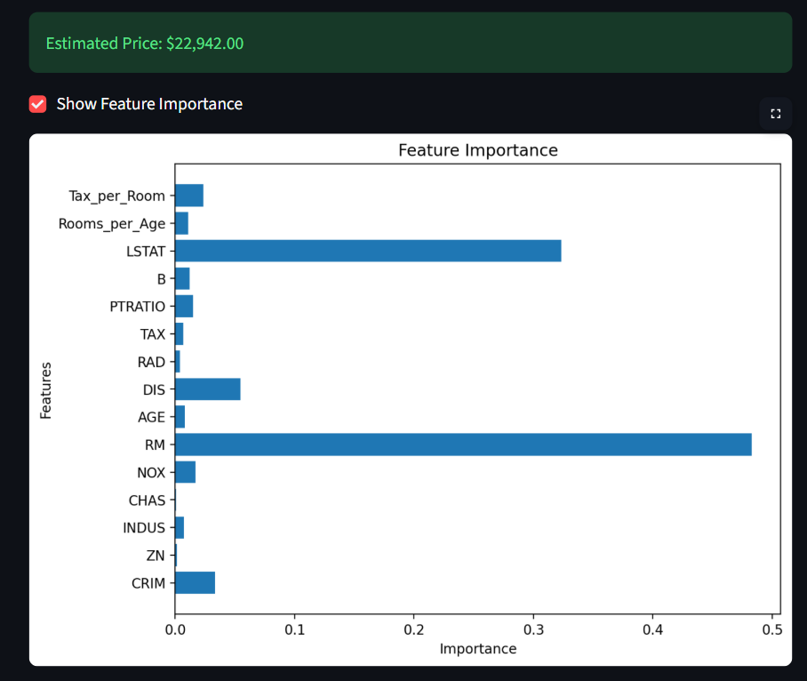
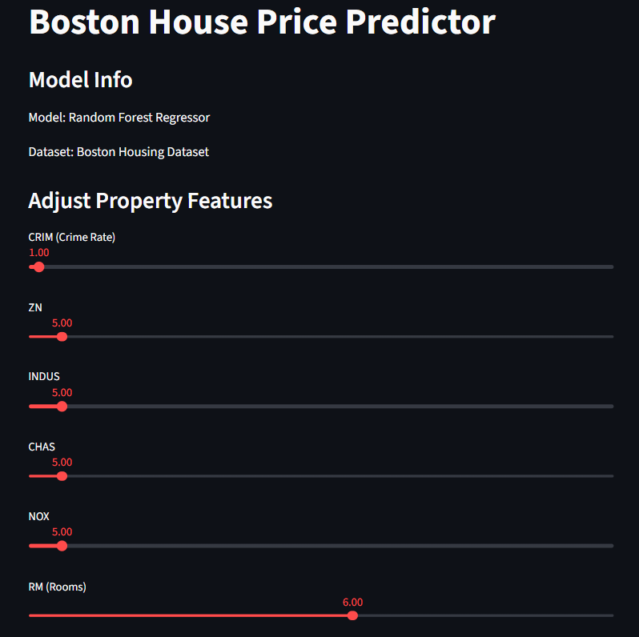
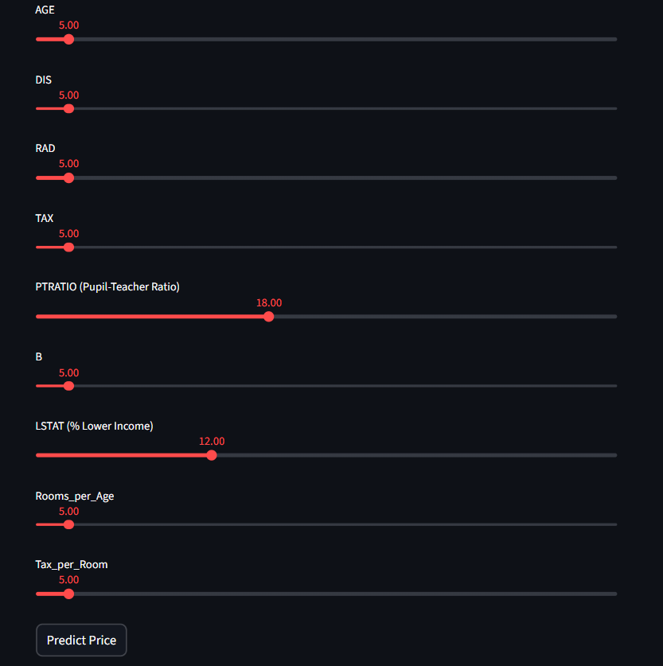

# 🏠 Boston House Price Prediction System

## 📌 Overview

This project is an end-to-end Machine Learning system that predicts house prices using the Boston Housing dataset. It covers the complete ML workflow starting from data preprocessing to deployment through an interactive web application.

The goal of this project is not just to train a model, but to build a practical system that can be used to estimate property prices based on different input features.

---

## 🎯 Problem Statement

Accurately estimating house prices is important for buyers, sellers, and real estate professionals. Manual estimation is often inconsistent and depends heavily on experience.

This project uses machine learning to provide a data-driven approach for predicting house prices based on various factors such as number of rooms, crime rate, and population characteristics.

---

## ⚙️ Technologies Used

- Python  
- Pandas & NumPy  
- Scikit-learn  
- Streamlit  
- Matplotlib  

---

## 🔄 Project Workflow

The project follows a structured machine learning pipeline:

1. **Data Preprocessing**
   - Loaded dataset and handled inconsistencies
   - Cleaned column names
   - Checked for missing values

2. **Feature Engineering**
   - Created new meaningful features like:
     - Rooms per age
     - Tax per room
   - Improved model performance using derived features

3. **Model Training**
   - Trained multiple models:
     - Linear Regression  
     - Random Forest Regressor  
   - Selected the best-performing model

4. **Model Evaluation**
   - Evaluated using:
     - RMSE (Root Mean Squared Error)
     - R² Score  
   - Compared model performance

5. **Model Deployment**
   - Built an interactive UI using Streamlit
   - Users can input feature values and get instant predictions

---

## 📊 Features Used in the Model

Some of the key features include:

- **RM** → Average number of rooms  
- **LSTAT** → Percentage of lower income population  
- **PTRATIO** → Student-teacher ratio  
- **CRIM** → Crime rate  
- **TAX** → Property tax rate  
- and other numerical features from the dataset  

--- 

## 📊 Sample Prediction

Example input:

- RM: 6  
- LSTAT: 12  
- PTRATIO: 18  
- CRIM: 1  
- Other features set to default values  

Output:

- Predicted House Price: ~ $22,942.00  

---

## 📸 Output Screenshot




---

## 🧠 Model Insights

- Number of rooms (RM) has a strong positive impact on price  
- Higher LSTAT values tend to reduce house prices  
- Crime rate and tax also influence predictions significantly  

---

## 🎨 Application Interface

The Streamlit app allows users to:

- Adjust property features using sliders  
- Predict house price instantly  
- View feature importance graph  

---

## 📸 Project Demo





---

## 💼 Business Use Case

This system can be useful for:

- Real estate agents to estimate property prices  
- Buyers to evaluate if a property is fairly priced  
- Investors to identify undervalued properties  
- Property platforms to automate price estimation  

---

## 🚀 How to Run the Project

### Step 1: Install dependencies
pip install -r requirements.txt

### Train the model
python main.py

### Run the application
cd app  
streamlit run app.py


---

## 📁 Project Structure
```
house-price-boston/
│
├── app/ # Streamlit app
├── data/ # Dataset
├── models/ # Saved model
├── src/ # ML pipeline code
├── main.py # Main execution file
├── image-1.png # Screenshot of the project
├── image-2.png # Screenshot of the project
├── image.png # Screenshot of the project
├── README.md
└── requirements.txt
```

---

## 💡 Key Learnings

- Building an end-to-end ML pipeline  
- Importance of feature engineering  
- Handling real-world data issues  
- Deploying ML models as applications  
- Improving user interaction with simple UI  

---

## 🔮 Future Improvements

- Add XGBoost for better performance  
- Improve UI design for better user experience  
- Add real-time data input integration  

---

## 📌 Conclusion

This project demonstrates how machine learning can be used to solve real-world problems by combining data processing, model building, and deployment into a single system. It reflects both technical understanding and practical implementation skills.

---
